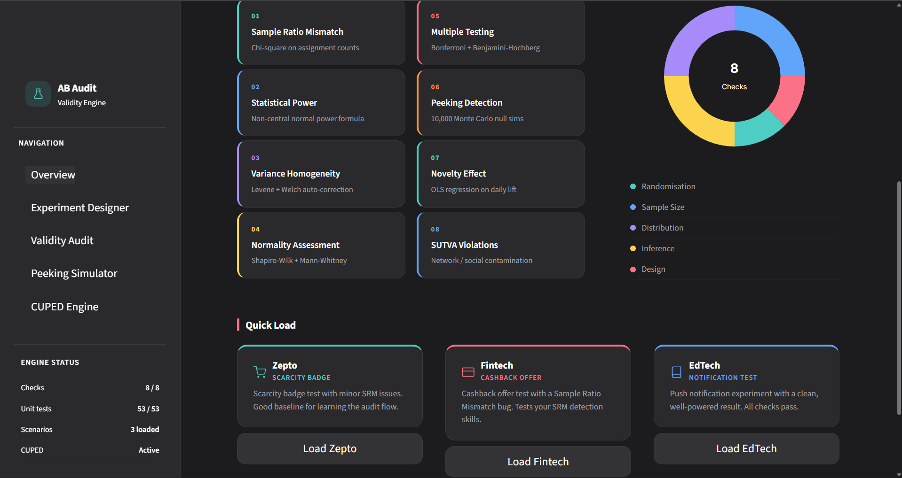
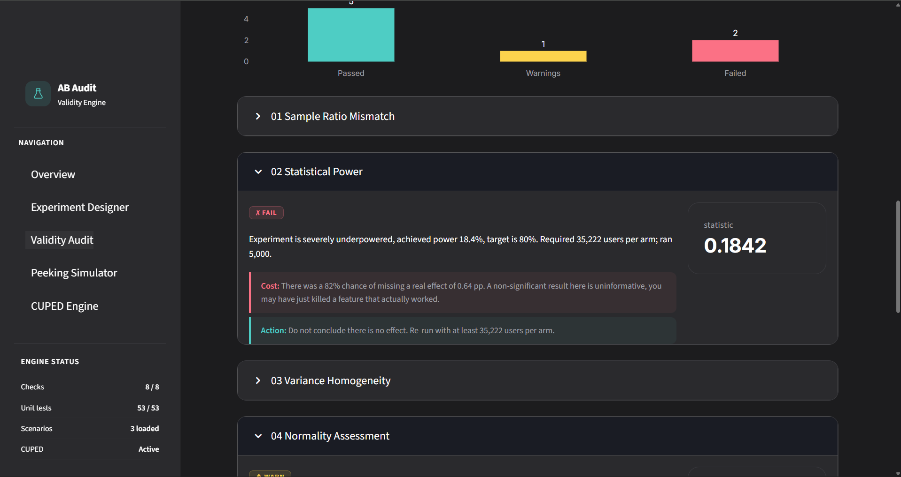
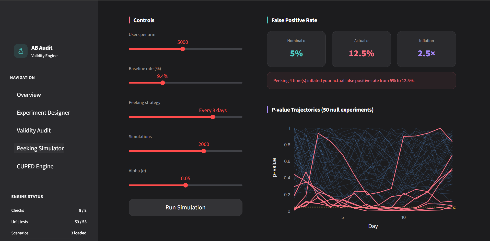
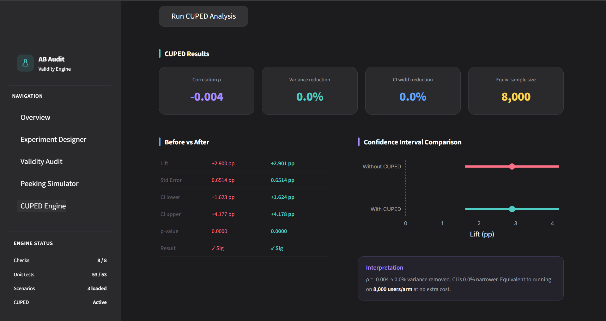
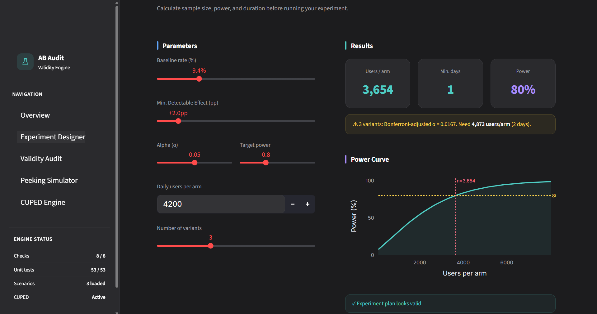

# AB Audit

**A statistical validity engine for A/B experiments.**

Most A/B tests shipped in industry are quietly broken — underpowered, peeked at early, or contaminated by network effects. AB Audit catches those problems before a team ships a decision based on bad data.

<p align="center">
  <a href="https://ab-audit-maneet.streamlit.app/" target="_blank">
    
  </a>
</p>
[](https://python.org)
[](https://streamlit.io)
[](LICENSE)
[]()
[]()

> demonstrating graduate-level statistical reasoning applied to real industry problems.

---

## Overview

AB Audit is a five-page diagnostic dashboard that audits experiment setups and results across eight statistical validity checks. It returns plain-English verdicts with quantified error consequences — not just pass/fail flags.

It is not another p-value calculator. Think of it as an experiment health monitor: upload your data, configure your test parameters, and get a structured readout of everything that could be misleading your conclusions.


*Overview page showing all 8 checks and quick-load demo scenarios*

---

## Features

**8 Validity Checks** run on every experiment:

| # | Check | Method |
|---|-------|--------|
| 1 | Sample Ratio Mismatch | Chi-square goodness-of-fit |
| 2 | Statistical Power | Non-central normal power formula |
| 3 | Variance Homogeneity | Levene's test with Welch correction |
| 4 | Normality Assessment | Shapiro-Wilk with Mann-Whitney fallback |
| 5 | Multiple Testing Correction | Bonferroni and Benjamini-Hochberg FDR |
| 6 | Peeking / Optional Stopping | 10,000-run Monte Carlo simulation |
| 7 | Novelty Effect Detection | OLS regression on daily lift trajectory |
| 8 | SUTVA / Network Contamination | Causal inference heuristics |

**Additional modules:**

- **CUPED Engine** — pre-experiment variance reduction (Deng et al. 2013). Typically cuts required sample size by 20-40% at no extra cost.
- **Peeking Simulator** — watch Type I error inflate live across 10,000 simulated null experiments as you adjust peeking strategy.
- **Experiment Designer** — sample size and power calculator with duration estimates.
- **Three prebuilt scenarios** — Zepto (scarcity badge, minor SRM), Fintech (cashback offer, SRM bug), EdTech (notification test, clean result).
- **PDF report export** — formatted like a real company experiment readout, downloadable in one click.

---

## Screenshots

| Page | Preview |
|------|---------|
| Overview |  |
| Validity Audit |  |
| Peeking Simulator |  |
| CUPED Engine |  |
| Experiment Designer |  |

> Add screenshots to `docs/screenshots/` after first run.

---

## Tech Stack

| Layer | Technology |
|-------|-----------|
| UI | Streamlit 1.x |
| Statistical engine | Python (NumPy, SciPy) |
| Charts | Plotly |
| Data handling | Pandas |
| Report generation | ReportLab / Markdown |
| Testing | pytest (53 tests) |

---

## Getting Started

### Prerequisites

- Python 3.11 or higher
- pip

### Installation

```bash
# 1. Clone the repository
git clone https://github.com/maneet-999/ab-audit.git
cd ab-audit

# 2. Create a virtual environment (recommended)
python -m venv venv
source venv/bin/activate        # macOS / Linux
venv\Scripts\activate           # Windows

# 3. Install dependencies
pip install -r requirements.txt

# 4. Run the app
streamlit run app/streamlit_app.py
```

The dashboard opens at `http://localhost:8501`.

---

## Usage

### Using a demo scenario

1. Open the **Overview** page.
2. Pick one of the three prebuilt scenarios (Zepto, Fintech, EdTech) in the Quick Load section.
3. Navigate to **Validity Audit** and click **Run Full Audit**.
4. Expand any check to see the verdict, cost of violation, and recommended fix.

### Using your own data

Upload a CSV with at minimum these columns:

| Column | Type | Description |
|--------|------|-------------|
| `arm` | string | `"control"` or `"treatment"` |
| `metric_value` | float | The outcome metric per user |
| `converted` | int | Binary outcome (0 or 1) |

Optional columns for CUPED: `pre_metric` (pre-experiment value for the same metric).

### Running the test suite

```bash
pytest tests/ -v
```

---

## Project Structure

```
ab_audit/
├── engine/
│   ├── __init__.py          # CheckResult, AuditResult, ExperimentConfig dataclasses
│   ├── checks.py            # All 8 statistical validity checks
│   ├── cuped.py             # CUPED variance reduction (Deng et al. 2013)
│   ├── data_generator.py    # Synthetic experiment data for demo scenarios
│   └── simulation.py        # Monte Carlo peeking engine (vectorised NumPy)
├── tests/
│   ├── test_checks.py       # Unit tests for all 8 checks
│   └── test_simulation.py   # Monte Carlo engine tests
├── docs/
│   └── screenshots/         # UI screenshots for README
├── streamlit_app.py         # Main Streamlit dashboard (5 pages)
├── requirements.txt         # Python dependencies
├── .gitignore               # Ignores data files, venv, cache, generated PDFs
├── LICENSE                  # MIT
├── CONTRIBUTING.md          # Contribution guidelines
└── README.md                # You are here
```

---

## Statistical References

This project implements methods from:

1. Kohavi, Tang & Xu (2020). *Trustworthy Online Controlled Experiments.* Cambridge University Press.
2. Deng, Xu, Kohavi & Walker (2013). *Improving the Sensitivity of Online Controlled Experiments by Utilizing Pre-Experiment Data.* KDD.
3. Johari, Pekelis & Walsh (2015). *Always Valid Inference.* arXiv:1512.04922.
4. Benjamini & Hochberg (1995). *Controlling the False Discovery Rate.* JRSS-B 57(1).
5. Fisher (1935). *The Design of Experiments.*

---

## Roadmap

- [ ] Sequential testing (always-valid p-values via mSPRT)
- [ ] Multi-metric experiment support
- [ ] Slack / email report delivery
- [ ] GitHub Actions CI for the test suite
- [ ] Streamlit Cloud one-click deployment
- [ ] Experiment registry to track multiple tests over time

---

## Contributing

Contributions are welcome. Please read [CONTRIBUTING.md](CONTRIBUTING.md) before opening a pull request.

In short: fork the repo, create a feature branch, write tests for any new statistical logic, and open a PR with a clear description.

---

## License

MIT. See [LICENSE](LICENSE) for details.

---

## Contact

**Maneet Gupta** — Statistics student, University of Delhi

- GitHub: [@maneet-999](https://github.com/maneet-999)
- LinkedIn: [maneet-gupta999](https://www.linkedin.com/in/maneet-gupta999/)
- Email: 2543maneet@gmail.com

---

*If this project was useful or interesting to you, a star helps with discoverability.*
